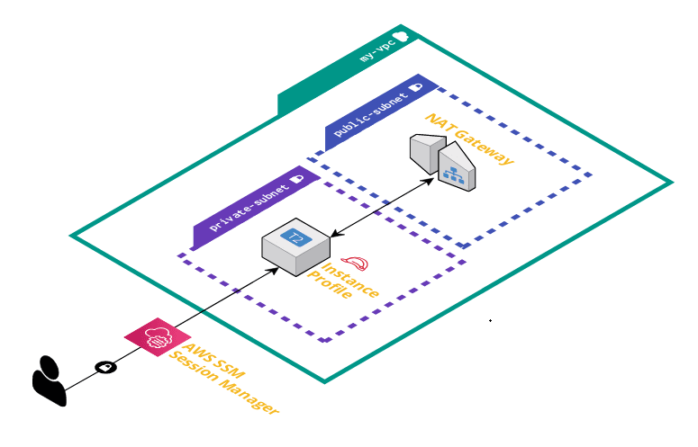

# DevOps Extravaganza

This is a small project with experiments of some DevOps tools.

## Dependencies

| Dependency        | Version |
| :---------------- | :------ |
| Kubernetes client | v1.19.7 |
| Kubernetes server | v1.20.2 |
| minikube          | v1.20.0 |
| terraform         | 1.0.0   |

## Docker

Two images are built: one of nginx with a custom index page and the other is
a tomcat server with a sample app.

## Kubernetes

The following services are deployed:

| Service           | Port | Number of replicas |
| :---------------- | :--- | :----------------- |
| Tomcat            | 8090 | 1                  |
| Tomcat sample.war | 8091 | 1                  |
| nginx             | 8080 | 3                  |
| jenkins           | 80   | 1                  |

Run `make build && make deploy` to build the images and create the deployments.
In another terminal, run `minikube tunnel` to make the services available on the
the host. On this experiments, the internal Docker storage is used as a Container
Image Registry for kubernetes, removing the requirement to use `hub.docker.com`.

**Note:** `LoadBalancer` service types are used alongside `minikube tunnel` in order to
bind the localhost `8090` and `8080` ports while using minikube on WSL2. Furthermore,
`NodePort` service type restricts me to use the port range `30000-32767` to access
the services from the browser. `hostPort` configuration apparently is not working on WSL2
([reference link](https://stackoverflow.com/questions/65659756/unable-to-connect-to-minikube-when-using-wsl)).

**Tip:** All scripts are intended to be executed from their directories.
This significantly simplifies the scripts, keeping them more maintainable.

### Details about Jenkins

Since its service bind to a port lower than 1024, you are going to need root
privileges in order to run `minikube tunnel`. Also, the password asked on
the setup that shows on the creation of the pod can be found in the logs of the pod itself.

# Terraform

The project deploys an instance with a CentOS AMI in a private subnet of a new VPC.
It access the internet through a NAT Gateway. The following image
shows a overall architecture.

Instance access is made without ssh key pairs. Instead, it uses AWS SSM Session Manager
for traceable and auditable access without static credentials stored in the
user's machine.
